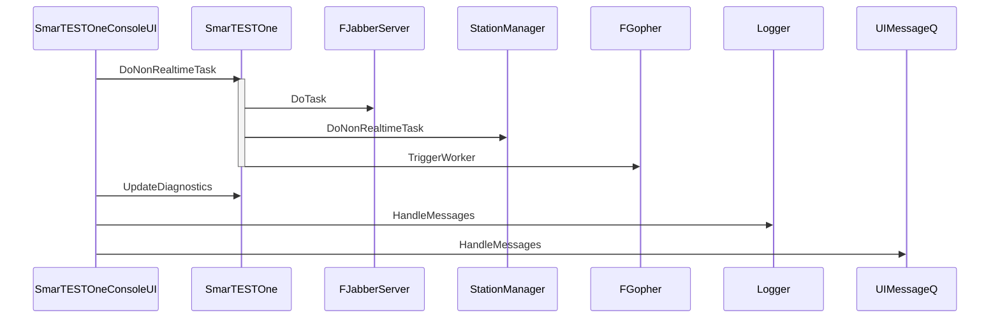

# ConsoleUI Deadlock

## Follow ups
* StationManager now uses a lock in the DoNonRealtimeTask to guard the station list (change from 3.14).
* Same for IsSequenceRunning, which used to be cached in the station manager, but is now called from a utility function ityerating over all stations.
* StationNode::DoNonRealtimeTask now also calls the DoNonRealtimeTasks of the SimulationApplication and StaticTestApplication

## ConsoleUI task breakdown

