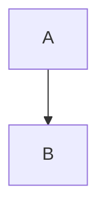

# Mermaid diagrams

[Mermaid](https://mermaidjs.github.io/) is a diagram rendering engine similar to PlantUML, but implemented in javascript, so no external programs are needed.

## Mermaid preprocessor
There is an mdBook preprocessor [here](https://github.com/badboy/mdbook-mermaid/), but it is not needed. It does however provide a nice stylesheet to properly render the mermaid diagrams.
The stylesheet borks the rendering of the TOC though. To fix this remove the opacity of the '.section' definition (line 95 in version 3cea267 dated 2 Oct 2018):
```css
.section {
  stroke: none;
  /*opacity: 0.2;*/
}
```

You can easily use mermaid by making the following changes to your book.toml:
```toml
[output.html]
additional-css = ["mermaid.css"]
additional-js = ["mermaid.min.js", "mermaid-init.js"]
```

Where mermaid.css come's from badboy's repo and mermaid-init.js contains the following code:
```js
// mdBook creates <code> elements with the class "language-mermaid hljs" whenever you
// define a mermaid code block.
// The mermaid javascript parser looks for elements with a class name 'mermaid'.
// So simply change the class name of the elements to 'mermaid' to make everything work.
function patchMermaidCodeElementClass() {
	var elements = document.getElementsByClassName("language-mermaid");
	for(var i=0; i < elements.length; i+=1) {
		var element = elements.item(i);
		if (element.tagName.toLowerCase() == "code") {
			element.className = "mermaid";
		}
	}
}

patchMermaidCodeElementClass();
mermaid.initialize({startOnLoad:true});
```

Example mermaid code block:
~~~

~~~

Which would render into the following image (if everything is working):

